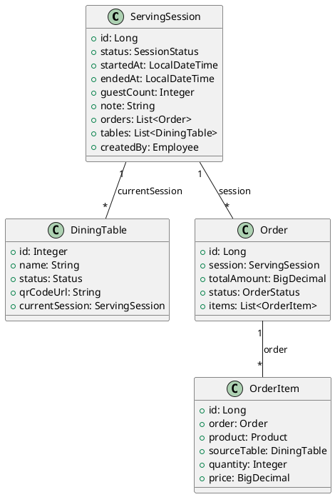

# Session-Based Design Document

## Tổng quan

Tài liệu này mô tả việc refactor hệ thống POS từ mô hình **Order ↔ Table** sang mô hình **Order ↔ Session ↔ Table**, nhằm giải quyết các vấn đề phức tạp trong nghiệp vụ gộp bàn, tách bàn, và chuyển bàn.

---

## Phần 1: Phân tích Hệ thống Hiện tại

### 1.1 Entity Diagram Hiện tại

```
┌─────────────────────────────────────────────────────────────────────────┐
│                           CURRENT DESIGN                                 │
│                                                                          │
│  ┌─────────────┐       1:N        ┌─────────────┐                       │
│  │ DiningTable │◄─────────────────┤    Order    │                       │
│  │             │   table_id (FK)  │             │                       │
│  │  - id       │                  │  - id       │                       │
│  │  - name     │                  │  - table_id │◄──────────┐           │
│  │  - status   │                  │  - status   │           │           │
│  │  - masterTbl├───┐              │  - total    │     ┌─────┴─────┐     │
│  └──────┬──────┘   │              └──────┬──────┘     │ OrderItem │     │
│         │          │                     │            │           │     │
│         │  self-ref│                     │ 1:N        │ - order_id│     │
│         │  (merge) │                     ▼            │ - product │     │
│         │          │              ┌─────────────┐     │ - originalTable │
│         └──────────┘              │  OrderItem  │     └───────────┘     │
│                                   │             │                       │
│                                   │ - originalTable (FK) ───────────────┼──┐
│                                   └─────────────┘                       │  │
│                                          │                              │  │
│                                          │ Để track món gọi từ bàn nào  │  │
│                                          └──────────────────────────────┘  │
│                                                                            │
└────────────────────────────────────────────────────────────────────────────┘
```

### 1.2 Các Entity Hiện tại

#### DiningTable
```java
@Entity
@Table(name = "dining_tables")
public class DiningTable extends BaseEntity {
    private Integer id;
    private String name;
    private Status status;        // AVAILABLE, SERVING, RESERVED
    private String qrCodeUrl;
    
    // Logic gộp bàn - Self-reference kiểu "Star"
    @ManyToOne
    private DiningTable masterTable;  // NULL nếu là Master
}
```

#### Order
```java
@Entity  
@Table(name = "orders")
public class Order extends BaseEntity {
    private Long id;
    
    @ManyToOne
    private DiningTable table;   // ← PHỤTHUỘC CỨNG VÀO TABLE
    
    private BigDecimal totalAmount;
    private OrderStatus status;   // OPEN, WAITING_PAYMENT, COMPLETED, CANCELLED
    private String paymentMethod;
    private Employee createdBy;
    private LocalDateTime completedAt;
    
    @OneToMany
    private List<OrderItem> items;
}
```

#### OrderItem
```java
@Entity
@Table(name = "order_items")  
public class OrderItem extends BaseEntity {
    private Long id;
    
    @ManyToOne
    private Order order;
    
    @ManyToOne
    private Product product;
    
    @ManyToOne
    private DiningTable originalTable;  // ← WORKAROUND: Track món gọi từ bàn nào khi gộp
    
    private Integer quantity;
    private BigDecimal price;
    private String note;
    private ItemStatus status;  // PENDING, SERVED, CANCELLED
}
```

### 1.3 Logic Nghiệp vụ Hiện tại

#### Merge Tables (Gộp bàn)
```java
// TableService.mergeTables()
- Target table trở thành Master
- Source tables đặt masterTable = target  
- Tất cả bàn chuyển sang SERVING nếu có bất kỳ bàn nào đang SERVING
```

#### Split Tables (Tách bàn)
```java
// TableService.splitTable()
- Nếu là Master: Giải tán nhóm, tất cả slave → AVAILABLE
- Nếu là Slave: Tách khỏi master
- KHÔNG CHO PHÉP TÁCH KHI ĐANG SERVING (throw exception)
```

#### Transfer Order (Chuyển bàn)
```java
// OrderService.transferOrder()
- Chuyển order.table sang bàn mới
- Release bàn cũ → AVAILABLE  
- Set bàn mới → SERVING
- KHÔNG THỂ chuyển nếu bàn đích đã có order
```

#### Create/Get Session
```java
// OrderService.createOrGetSession()
- Input: tableId
- Resolve masterTable nếu table đã gộp
- Tìm order OPEN theo masterTable
- Nếu không có → tạo order mới gắn với masterTable
```

---

## 1.4 Vấn đề Thiết kế Hiện tại

### ❌ Vấn đề 1: Order Phụ thuộc Cứng vào Table

```
Order.table = DiningTable   // FK NOT NULL
```

**Hệ quả:**
- Order không tồn tại độc lập với Table
- Không thể tạo order trước rồi assign table sau
- Mọi thao tác phải đi qua Table

### ❌ Vấn đề 2: Logic Gộp Bàn Phức tạp (Star Pattern)

```
         ┌─────┐
         │ T1  │ (Master)
         └──┬──┘
            │ masterTable
    ┌───────┼───────┐
    ▼       ▼       ▼
┌─────┐ ┌─────┐ ┌─────┐
│ T2  │ │ T3  │ │ T4  │  (Slaves)
└─────┘ └─────┘ └─────┘
```

**Hệ quả:**
- Phải luôn resolve master trước khi làm gì với order
- Khi chuyển bàn phải xử lý cả nhóm
- Logic rời rạc, khó debug

### ❌ Vấn đề 3: Không Có Khái Niệm "Phiên Phục Vụ"

**Hệ quả:**
- Không track được timeline: ai vào lúc nào, ngồi bao lâu
- Không thể dễ dàng split bill
- Khó mở rộng thêm nghiệp vụ (VD: đặt bàn trước)

### ❌ Vấn đề 4: Chuyển Bàn ≡ Chuyển Order

Hiện tại `transferOrder()` thực chất là:
```java
order.setTable(targetTable);  // Chuyển cả order sang bàn mới
```

**Vấn đề:**
- Không thể chuyển một phần khách sang bàn khác
- Nếu bàn đã gộp, chuyển cả nhóm hay chỉ 1 bàn?
- Không rõ semantics: chuyển khách hay chuyển tài nguyên?

### ❌ Vấn đề 5: Tách Bàn Bị Block Khi Đang Phục Vụ

```java
if (table.getStatus() == SERVING) {
    throw new AppException(400, "Bàn đang phục vụ...");
}
```

**Hệ quả:**
- Không thể tách một bàn ra khỏi nhóm khi đang ăn
- Không thể split bill theo bàn
- Logic quá cứng nhắc cho thực tế F&B

### ❌ Vấn đề 6: OrderItem.originalTable - Workaround

```java
@ManyToOne
private DiningTable originalTable;  // Track món gọi từ bàn nào
```

**Nhận xét:**
- Đây là dấu hiệu thiết kế đang thiếu entity trung gian
- Thông tin này nên thuộc về Session, không phải OrderItem

---

## Phần 2: Thiết Kế Domain Model Mới (Session-Based)

### 2.1 Tư Duy Chuyển Đổi

```
HIỆN TẠI:                              MỚI:
                                       
Order ←──→ Table                       Order ←──→ Session ←──→ Table(s)
   │                                      │           │
   │ 1:1 (thực tế)                        │ N:1       │ N:M
   └─ Không linh hoạt                     └─ Linh hoạt hơn
```

### 2.2 Định Nghĩa Session

> **Session** (Phiên phục vụ) đại diện cho **một lần phục vụ khách hàng**, 
> từ lúc khách ngồi xuống đến khi thanh toán xong và rời đi.

**Đặc điểm:**
- Session là chủ thể trung tâm, sở hữu Order(s)
- Table chỉ là tài nguyên vật lý được gán vào Session
- Một Session có thể có nhiều Table (khi gộp)
- Một Session có thể có nhiều Order (split bill trong tương lai)

### 2.3 Entity Diagram Mới

```
┌─────────────────────────────────────────────────────────────────────────────┐
│                          NEW SESSION-BASED DESIGN                            │
│                                                                              │
│   ┌─────────────┐                    ┌─────────────┐                        │
│   │ DiningTable │                    │   Session   │                        │
│   │             │                    │             │                        │
│   │  - id       │                    │  - id       │                        │
│   │  - name     │       N:1          │  - status   │                        │
│   │  - status   │◄───────────────────┤  - startAt  │                        │
│   │  - sessionId│  (session_id FK)   │  - endAt    │                        │
│   │             │                    │  - guestCnt │                        │
│   │  // KHÔNG   │                    │             │                        │
│   │  // còn     │                    └──────┬──────┘                        │
│   │  // masterTbl                           │                               │
│   └─────────────┘                           │ 1:N                           │
│                                             ▼                               │
│                                      ┌─────────────┐                        │
│                                      │    Order    │                        │
│                                      │             │                        │
│                                      │  - id       │                        │
│                                      │  - sessionId│  (session_id FK)       │
│                                      │  - status   │                        │
│                                      │  - total    │                        │
│                                      │             │                        │
│                                      │  // KHÔNG   │                        │
│                                      │  // còn     │                        │
│                                      │  // table_id│                        │
│                                      └──────┬──────┘                        │
│                                             │                               │
│                                             │ 1:N                           │
│                                             ▼                               │
│                                      ┌─────────────┐                        │
│                                      │  OrderItem  │                        │
│                                      │             │                        │
│                                      │  - orderId  │                        │
│                                      │  - productId│                        │
│                                      │  - originTbl│  (optional: track)     │
│                                      └─────────────┘                        │
│                                                                              │
└──────────────────────────────────────────────────────────────────────────────┘
```

### 2.4 Entity Definitions

#### Session (MỚI)
```java
@Entity
@Table(name = "serving_sessions")
public class ServingSession extends BaseEntity {
    
    @Id
    @GeneratedValue(strategy = GenerationType.IDENTITY)
    private Long id;
    
    @Enumerated(EnumType.STRING)
    @Column(length = 20)
    private SessionStatus status = SessionStatus.ACTIVE;
    
    @Column(name = "started_at")
    private LocalDateTime startedAt;
    
    @Column(name = "ended_at")
    private LocalDateTime endedAt;
    
    @Column(name = "guest_count")
    private Integer guestCount;   // Số khách (optional)
    
    @Column(name = "note")
    private String note;          // Ghi chú (VD: "Tiệc sinh nhật")
    
    // Session sở hữu nhiều Order (hỗ trợ split bill sau này)
    @OneToMany(mappedBy = "session", cascade = CascadeType.ALL)
    private List<Order> orders = new ArrayList<>();
    
    // Session chiếm nhiều bàn
    @OneToMany(mappedBy = "currentSession")
    private List<DiningTable> tables = new ArrayList<>();
    
    @ManyToOne(fetch = FetchType.LAZY)
    @JoinColumn(name = "created_by")
    private Employee createdBy;
    
    public enum SessionStatus {
        ACTIVE,     // Đang phục vụ
        COMPLETED,  // Đã thanh toán xong
        CANCELLED   // Đã hủy
    }
}
```

#### DiningTable (SỬA ĐỔI)
```java
@Entity
@Table(name = "dining_tables")
public class DiningTable extends BaseEntity {
    
    @Id
    @GeneratedValue(strategy = GenerationType.IDENTITY)
    private Integer id;
    
    private String name;
    
    @Enumerated(EnumType.STRING)
    private Status status = Status.AVAILABLE;
    
    private String qrCodeUrl;
    
    // ✅ THAY THẾ masterTable bằng reference đến Session
    @ManyToOne(fetch = FetchType.LAZY)
    @JoinColumn(name = "current_session_id")
    private ServingSession currentSession;  // NULL = bàn trống
    
    // ❌ XÓA BỎ: masterTable không còn cần thiết
    // private DiningTable masterTable;
    
    public enum Status {
        AVAILABLE,  // Trống, sẵn sàng
        OCCUPIED,   // Đang có khách (thuộc 1 session)
        RESERVED    // Đã đặt trước
    }
}
```

#### Order (SỬA ĐỔI)
```java
@Entity
@Table(name = "orders")
public class Order extends BaseEntity {
    
    @Id
    @GeneratedValue(strategy = GenerationType.IDENTITY)
    private Long id;
    
    // ✅ Order thuộc về Session, KHÔNG thuộc Table
    @ManyToOne(fetch = FetchType.LAZY)
    @JoinColumn(name = "session_id", nullable = false)
    private ServingSession session;
    
    // ❌ XÓA BỎ: table_id không còn cần thiết
    // private DiningTable table;
    
    private BigDecimal totalAmount = BigDecimal.ZERO;
    
    @Enumerated(EnumType.STRING)
    private OrderStatus status = OrderStatus.OPEN;
    
    private String paymentMethod;
    
    @ManyToOne(fetch = FetchType.LAZY)
    private Employee createdBy;
    
    private LocalDateTime completedAt;
    
    @OneToMany(mappedBy = "order", cascade = CascadeType.ALL)
    private List<OrderItem> items = new ArrayList<>();
    
    // Helper: Lấy "bàn chính" để hiển thị (bàn đầu tiên của session)
    public DiningTable getPrimaryTable() {
        if (session == null || session.getTables().isEmpty()) return null;
        return session.getTables().get(0);
    }
}
```

#### OrderItem (GIỮ NGUYÊN, optional tweak)
```java
@Entity
@Table(name = "order_items")
public class OrderItem extends BaseEntity {
    
    private Long id;
    
    @ManyToOne
    private Order order;
    
    @ManyToOne
    private Product product;
    
    // Giữ lại để track món từ bàn nào (khi gộp bàn)
    @ManyToOne(fetch = FetchType.LAZY)
    @JoinColumn(name = "source_table_id")
    private DiningTable sourceTable;  // Đổi tên cho rõ nghĩa hơn
    
    private Integer quantity;
    private BigDecimal price;
    private String note;
    private ItemStatus status;
}
```

### 2.5 Vòng Đời Session

```
                    ┌─────────────────────────────────────────┐
                    │            SESSION LIFECYCLE            │
                    └─────────────────────────────────────────┘

     ╔═══════════════╗
     ║   KHÁCH ĐẾN   ║
     ╚═══════╤═══════╝
             │
             ▼
    ┌────────────────┐
    │  Chọn bàn/QR   │
    └───────┬────────┘
            │
            ▼
╔═══════════════════════════════════════════════════════════════════════════╗
║                          SESSION: ACTIVE                                   ║
╠═══════════════════════════════════════════════════════════════════════════╣
║                                                                           ║
║   ┌─────────┐    ┌──────────┐    ┌──────────┐    ┌──────────┐            ║
║   │ Gọi món │───▶│ Gộp bàn  │───▶│ Tách bàn │───▶│Chuyển bàn│            ║
║   └─────────┘    └──────────┘    └──────────┘    └──────────┘            ║
║        │              │               │               │                   ║
║        │   (Thêm table vào session)   │    (Di chuyển table)             ║
║        │              │               │               │                   ║
║        ▼              ▼               ▼               ▼                   ║
║   ┌─────────────────────────────────────────────────────────┐            ║
║   │                    ORDER(s) trong Session               │            ║
║   │  - Thêm món                                             │            ║
║   │  - Xóa món (PENDING)                                    │            ║
║   │  - Cập nhật số lượng                                    │            ║
║   └─────────────────────────────────────────────────────────┘            ║
║                                                                           ║
╚═══════════════════════════════════════════════════════════════════════════╝
            │
            │ Yêu cầu thanh toán
            ▼
    ┌────────────────┐
    │  Thanh toán    │
    │  (Cash/VNPay)  │
    └───────┬────────┘
            │
            ▼
╔═══════════════════════════════════════════════════════════════════════════╗
║                        SESSION: COMPLETED                                  ║
╠═══════════════════════════════════════════════════════════════════════════╣
║  - Tất cả Order → COMPLETED                                               ║
║  - Tất cả Table → AVAILABLE, currentSession = null                        ║
║  - Lưu endedAt                                                            ║
║  - In hóa đơn                                                             ║
╚═══════════════════════════════════════════════════════════════════════════╝
            │
            ▼
     ╔═══════════════╗
     ║   KHÁCH ĐI    ║
     ╚═══════════════╝
```

---

## Phần 3: Thiết Kế Luồng Nghiệp vụ Chi tiết

### 3.1 Mở Bàn (Tạo Session)

**Trigger:** Khách quét QR / Nhân viên mở bàn

```
┌──────────────────────────────────────────────────────────────┐
│ USE CASE: MỞ BÀN                                             │
├──────────────────────────────────────────────────────────────┤
│ Input: tableId                                               │
│                                                              │
│ Flow:                                                        │
│   1. Lấy DiningTable theo tableId                            │
│   2. IF table.currentSession != null                         │
│        → Trả về session đang có (không tạo mới)              │
│   3. ELSE                                                    │
│        → Tạo Session mới (status=ACTIVE)                     │
│        → Gán table.currentSession = newSession               │
│        → Set table.status = OCCUPIED                         │
│        → Tạo Order mới gắn với Session                       │
│                                                              │
│ Output: SessionResponse (chứa session + order + tables)      │
├──────────────────────────────────────────────────────────────┤
│ Session thay đổi? ✅ TẠO MỚI                                 │
│ Order thay đổi?   ✅ TẠO MỚI (gắn với Session)               │
│ Table vai trò?    Được gán vào Session mới                   │
└──────────────────────────────────────────────────────────────┘
```

**Code mẫu:**
```java
@Transactional
public ServingSession openTable(Integer tableId) {
    DiningTable table = tableRepository.findById(tableId)
        .orElseThrow(() -> new AppException(404, "Bàn không tồn tại"));
    
    // Nếu bàn đã có session → trả về session đó
    if (table.getCurrentSession() != null) {
        return table.getCurrentSession();
    }
    
    // Tạo session mới
    ServingSession session = ServingSession.builder()
        .status(SessionStatus.ACTIVE)
        .startedAt(LocalDateTime.now())
        .createdBy(getCurrentStaff())
        .build();
    session = sessionRepository.save(session);
    
    // Gán table vào session
    table.setCurrentSession(session);
    table.setStatus(DiningTable.Status.OCCUPIED);
    tableRepository.save(table);
    
    // Tạo order mặc định
    Order order = Order.builder()
        .session(session)
        .status(OrderStatus.OPEN)
        .build();
    orderRepository.save(order);
    
    return session;
}
```

---

### 3.2 Gộp Bàn

**Trigger:** Nhân viên muốn gộp nhiều bàn lại phục vụ chung 1 nhóm khách

```
┌──────────────────────────────────────────────────────────────┐
│ USE CASE: GỘP BÀN                                            │
├──────────────────────────────────────────────────────────────┤
│ Input: sessionId, tableIdsToAdd[]                            │
│                                                              │
│ Flow:                                                        │
│   1. Lấy Session đang active                                 │
│   2. Với mỗi tableId trong tableIdsToAdd:                    │
│      a. Kiểm tra table.currentSession == null (phải trống)   │
│      b. Gán table.currentSession = session                   │
│      c. Set table.status = OCCUPIED                          │
│   3. Notify update                                           │
│                                                              │
│ Output: SessionResponse (với danh sách tables mới)           │
├──────────────────────────────────────────────────────────────┤
│ Session thay đổi? ❌ KHÔNG (vẫn session cũ)                  │
│ Order thay đổi?   ❌ KHÔNG (order vẫn thuộc session)         │
│ Table vai trò?    Thêm tables vào session hiện tại           │
└──────────────────────────────────────────────────────────────┘
```

**So sánh với cách cũ:**
```
CŨ:  Table.masterTable = anotherTable  (Star pattern, phức tạp)
MỚI: Table.currentSession = session     (Flat, đơn giản)
```

**Code mẫu:**
```java
@Transactional
public void addTablesToSession(Long sessionId, List<Integer> tableIds) {
    ServingSession session = sessionRepository.findById(sessionId)
        .orElseThrow(() -> new AppException(404, "Session không tồn tại"));
    
    for (Integer tableId : tableIds) {
        DiningTable table = tableRepository.findById(tableId)
            .orElseThrow(() -> new AppException(404, "Bàn không tồn tại: " + tableId));
        
        if (table.getCurrentSession() != null) {
            throw new AppException(400, "Bàn " + table.getName() + " đang có khách");
        }
        
        table.setCurrentSession(session);
        table.setStatus(DiningTable.Status.OCCUPIED);
        tableRepository.save(table);
    }
    
    notifySessionUpdate(session);
}
```

---

### 3.3 Tách Bàn

**Có 2 loại tách bàn:**

#### 3.3.1 Tách bàn đơn giản (Giải phóng 1 bàn)

**Scenario:** Khách ngồi bàn 1+2+3, bây giờ bàn 3 không cần nữa → trả bàn 3.

```
┌──────────────────────────────────────────────────────────────┐
│ USE CASE: TÁCH BÀN (ĐƠN GIẢN)                                │
├──────────────────────────────────────────────────────────────┤
│ Input: tableId                                               │
│                                                              │
│ Precondition: Session có >= 2 bàn                            │
│                                                              │
│ Flow:                                                        │
│   1. Lấy table và session của nó                             │
│   2. IF session.tables.size() == 1                           │
│        → Không cho tách (phải có ít nhất 1 bàn)              │
│   3. ELSE                                                    │
│        → Set table.currentSession = null                     │
│        → Set table.status = AVAILABLE                        │
│                                                              │
│ Output: Success                                              │
├──────────────────────────────────────────────────────────────┤
│ Session thay đổi? ❌ VẪN GIỮ (chỉ ít bàn hơn)               │
│ Order thay đổi?   ❌ VẪN GIỮ                                 │
│ Table vai trò?    Bị tách ra, trở về AVAILABLE               │
└──────────────────────────────────────────────────────────────┘
```

#### 3.3.2 Tách session (Split Session)

**Scenario:** Khách ngồi bàn 1+2+3, bây giờ bàn 3 muốn thanh toán riêng → tách thành 2 session.

```
┌──────────────────────────────────────────────────────────────┐
│ USE CASE: TÁCH SESSION (SPLIT)                               │
├──────────────────────────────────────────────────────────────┤
│ Input: sourceSessionId, tableIdsToSplit[], itemIdsToMove[]   │
│                                                              │
│ Flow:                                                        │
│   1. Tạo Session mới (newSession)                            │
│   2. Với mỗi tableId trong tableIdsToSplit:                  │
│        → Set table.currentSession = newSession               │
│   3. Tạo Order mới trong newSession                          │
│   4. Move các OrderItem được chọn sang Order mới             │
│   5. Recalculate totalAmount cho cả 2 order                  │
│                                                              │
│ Output: { originalSession, newSession }                      │
├──────────────────────────────────────────────────────────────┤
│ Session thay đổi? ✅ TẠO SESSION MỚI                         │
│ Order thay đổi?   ✅ TẠO ORDER MỚI + CHUYỂN ITEMS            │
│ Table vai trò?    Một số table chuyển sang session mới       │
└──────────────────────────────────────────────────────────────┘
```

**Lựa chọn thiết kế:** Chọn **cả 2 loại** vì:
- Tách bàn đơn giản: Dùng khi chỉ muốn thu hẹp không gian
- Tách session: Dùng khi muốn split bill

---

### 3.4 Chuyển Bàn

**Quan trọng:** Chuyển bàn ≠ Chuyển Order

**Có 2 loại chuyển bàn:**

#### 3.4.1 Chuyển thêm bàn vào Session

**Scenario:** Khách đang ngồi bàn 1, muốn ngồi thêm bàn 5 (vì đông hơn).

→ Đây thực chất là **Gộp bàn** (xem mục 3.2)

#### 3.4.2 Chuyển toàn bộ Session sang bàn khác

**Scenario:** Khách đang ngồi bàn 1, muốn đổi sang bàn 5 (vì thích view hơn).

```
┌──────────────────────────────────────────────────────────────┐
│ USE CASE: CHUYỂN BÀN (TOÀN BỘ SESSION)                       │
├──────────────────────────────────────────────────────────────┤
│ Input: sessionId, newTableIds[]                              │
│                                                              │
│ Flow:                                                        │
│   1. Lấy Session                                             │
│   2. Validate: tất cả newTableIds phải đang trống            │
│   3. Release tất cả tables cũ:                               │
│        → Set oldTable.currentSession = null                  │
│        → Set oldTable.status = AVAILABLE                     │
│   4. Assign tables mới:                                      │
│        → Set newTable.currentSession = session               │
│        → Set newTable.status = OCCUPIED                      │
│                                                              │
│ Output: SessionResponse (với tables mới)                     │
├──────────────────────────────────────────────────────────────┤
│ Session thay đổi? ❌ VẪN GIỮ (chỉ đổi tables)               │
│ Order thay đổi?   ❌ VẪN GIỮ                                 │
│ Table vai trò?    Swap: cũ → trống, mới → OCCUPIED           │
└──────────────────────────────────────────────────────────────┘
```

**Code mẫu:**
```java
@Transactional
public void transferSession(Long sessionId, List<Integer> newTableIds) {
    ServingSession session = sessionRepository.findById(sessionId)
        .orElseThrow(() -> new AppException(404, "Session không tồn tại"));
    
    // Validate tables mới phải trống
    for (Integer tableId : newTableIds) {
        DiningTable table = tableRepository.findById(tableId).orElseThrow();
        if (table.getCurrentSession() != null) {
            throw new AppException(400, "Bàn " + table.getName() + " đang có khách");
        }
    }
    
    // Release tables cũ
    for (DiningTable oldTable : session.getTables()) {
        oldTable.setCurrentSession(null);
        oldTable.setStatus(DiningTable.Status.AVAILABLE);
    }
    tableRepository.saveAll(session.getTables());
    
    // Assign tables mới
    List<DiningTable> newTables = tableRepository.findAllById(newTableIds);
    for (DiningTable newTable : newTables) {
        newTable.setCurrentSession(session);
        newTable.setStatus(DiningTable.Status.OCCUPIED);
    }
    tableRepository.saveAll(newTables);
    
    notifySessionUpdate(session);
}
```

---

### 3.5 Thanh Toán

```
┌──────────────────────────────────────────────────────────────┐
│ USE CASE: THANH TOÁN                                         │
├──────────────────────────────────────────────────────────────┤
│ Input: sessionId, paymentMethod                              │
│                                                              │
│ Flow:                                                        │
│   1. Lấy Session và tất cả Orders                            │
│   2. Validate: tất cả orders.status == OPEN                  │
│   3. Với mỗi Order:                                          │
│        → Set order.status = COMPLETED                        │
│        → Set order.completedAt = now()                       │
│        → Set order.paymentMethod = paymentMethod             │
│   4. Release tất cả tables:                                  │
│        → Set table.currentSession = null                     │
│        → Set table.status = AVAILABLE                        │
│   5. Close session:                                          │
│        → Set session.status = COMPLETED                      │
│        → Set session.endedAt = now()                         │
│   6. Tạo PaymentTransaction                                  │
│   7. Generate Invoice                                        │
│                                                              │
│ Output: InvoiceDto                                           │
├──────────────────────────────────────────────────────────────┤
│ Session thay đổi? ✅ COMPLETED                               │
│ Order thay đổi?   ✅ COMPLETED                               │
│ Table vai trò?    Giải phóng → AVAILABLE                     │
└──────────────────────────────────────────────────────────────┘
```

---

### 3.6 Đóng Session (Hủy)

```
┌──────────────────────────────────────────────────────────────┐
│ USE CASE: HỦY SESSION                                        │
├──────────────────────────────────────────────────────────────┤
│ Input: sessionId, reason                                     │
│                                                              │
│ Flow:                                                        │
│   1. Lấy Session                                             │
│   2. Với mỗi Order trong session:                            │
│        → Set order.status = CANCELLED                        │
│   3. Release tất cả tables                                   │
│   4. Set session.status = CANCELLED                          │
│   5. Log reason                                              │
│                                                              │
│ Output: Success                                              │
├──────────────────────────────────────────────────────────────┤
│ Session thay đổi? ✅ CANCELLED                               │
│ Order thay đổi?   ✅ CANCELLED                               │
│ Table vai trò?    Giải phóng → AVAILABLE                     │
└──────────────────────────────────────────────────────────────┘
```

---

## Phần 4: Thiết Kế API Mới

### 4.1 Tổng quan API Changes

```
┌─────────────────────────────────────────────────────────────────────────────┐
│                            API MIGRATION PLAN                               │
├─────────────────────────────────────────────────────────────────────────────┤
│                                                                             │
│  ❌ DEPRECATED (sẽ xóa)                │  ✅ NEW ENDPOINTS                  │
│  ─────────────────────────────         │  ─────────────────────────────     │
│  GET  /api/pos/orders/table/{id}       │  POST /api/pos/sessions           │
│  POST /api/pos/tables/merge            │  GET  /api/pos/sessions/{id}      │
│  POST /api/pos/tables/{id}/split       │  POST /api/pos/sessions/{id}/merge│
│  POST /api/pos/orders/{id}/transfer    │  POST /api/pos/sessions/{id}/split│
│                                        │  POST /api/pos/sessions/{id}/transfer│
│                                        │  POST /api/pos/sessions/{id}/close│
│                                                                             │
│  ♻️ MODIFIED ENDPOINTS                                                      │
│  ─────────────────────────────                                              │
│  POST /api/pos/orders/table/{id}/items  →  POST /api/pos/sessions/{id}/items│
│  POST /api/pos/orders/{id}/pay/cash     →  POST /api/pos/sessions/{id}/pay  │
│                                                                             │
└─────────────────────────────────────────────────────────────────────────────┘
```

### 4.2 Chi tiết API Mới

---

#### `POST /api/pos/sessions`
**Purpose:** Tạo session mới (mở bàn)

**Request:**
```json
{
  "tableId": 1,
  "guestCount": 4,        // optional
  "note": "Tiệc sinh nhật" // optional
}
```

**Response:**
```json
{
  "success": true,
  "data": {
    "sessionId": 100,
    "status": "ACTIVE",
    "startedAt": "2026-01-01T10:00:00",
    "tables": [
      { "id": 1, "name": "Bàn 01", "status": "OCCUPIED" }
    ],
    "orders": [
      {
        "orderId": 1001,
        "status": "OPEN",
        "totalAmount": 0,
        "items": []
      }
    ]
  }
}
```

---

#### `GET /api/pos/sessions/{sessionId}`
**Purpose:** Lấy thông tin session hiện tại

**Response:**
```json
{
  "success": true,
  "data": {
    "sessionId": 100,
    "status": "ACTIVE",
    "startedAt": "2026-01-01T10:00:00",
    "guestCount": 4,
    "tables": [
      { "id": 1, "name": "Bàn 01", "status": "OCCUPIED" },
      { "id": 2, "name": "Bàn 02", "status": "OCCUPIED" }
    ],
    "orders": [
      {
        "orderId": 1001,
        "status": "OPEN",
        "totalAmount": 250000,
        "items": [
          {
            "itemId": 1,
            "productId": 10,
            "productName": "Phở bò",
            "quantity": 2,
            "price": 50000,
            "sourceTable": { "id": 1, "name": "Bàn 01" },
            "status": "PENDING"
          }
        ]
      }
    ]
  }
}
```

---

#### `GET /api/pos/sessions/table/{tableId}`
**Purpose:** Lấy session theo tableId (dùng khi quét QR)

**Response:** Giống GET /api/pos/sessions/{sessionId}
- Nếu table chưa có session → tự động tạo mới
- Nếu table đã có session → trả về session đó

---

#### `POST /api/pos/sessions/{sessionId}/items`
**Purpose:** Thêm món vào session

**Request:**
```json
{
  "sourceTableId": 1,  // optional: bàn nào gọi món
  "items": [
    { "productId": 10, "quantity": 2, "note": "Ít cay" },
    { "productId": 11, "quantity": 1 }
  ]
}
```

**Response:**
```json
{
  "success": true,
  "message": "Đã thêm 2 món"
}
```

---

#### `POST /api/pos/sessions/{sessionId}/merge`
**Purpose:** Gộp thêm bàn vào session

**Request:**
```json
{
  "tableIds": [2, 3]
}
```

**Response:**
```json
{
  "success": true,
  "message": "Đã gộp bàn 2, 3 vào session"
}
```

---

#### `POST /api/pos/sessions/{sessionId}/split`
**Purpose:** Tách bàn hoặc tách session

**Request (tách bàn đơn giản):**
```json
{
  "type": "RELEASE_TABLE",
  "tableId": 3
}
```

**Request (tách session + split bill):**
```json
{
  "type": "SPLIT_SESSION",
  "tableIds": [3],
  "itemIds": [101, 102, 103]  // Các món chuyển sang session mới
}
```

**Response (split session):**
```json
{
  "success": true,
  "data": {
    "originalSession": {
      "sessionId": 100,
      "tables": [{ "id": 1 }, { "id": 2 }],
      "orderTotal": 150000
    },
    "newSession": {
      "sessionId": 101,
      "tables": [{ "id": 3 }],
      "orderTotal": 100000
    }
  }
}
```

---

#### `POST /api/pos/sessions/{sessionId}/transfer`
**Purpose:** Chuyển session sang bàn khác

**Request:**
```json
{
  "newTableIds": [5, 6]
}
```

**Response:**
```json
{
  "success": true,
  "message": "Đã chuyển session sang bàn 5, 6"
}
```

---

#### `POST /api/pos/sessions/{sessionId}/pay`
**Purpose:** Thanh toán và đóng session

**Request:**
```json
{
  "method": "CASH"  // hoặc "VNPAY", "MOMO"
}
```

**Response:**
```json
{
  "success": true,
  "data": {
    "invoice": {
      "sessionId": 100,
      "tenantName": "Quán ABC",
      "tableName": "Bàn 01, Bàn 02",
      "checkInTime": "2026-01-01T10:00:00",
      "checkOutTime": "2026-01-01T12:30:00",
      "items": [...],
      "totalAmount": 250000,
      "paymentMethod": "CASH"
    }
  }
}
```

---

#### `POST /api/pos/sessions/{sessionId}/cancel`
**Purpose:** Hủy session

**Request:**
```json
{
  "reason": "Khách hủy bàn"
}
```

**Response:**
```json
{
  "success": true,
  "message": "Đã hủy session"
}
```

---

### 4.3 API Backward Compatibility

Để không break frontend hiện tại, giữ lại các endpoint cũ nhưng redirect nội bộ:

```java
// Adapter để hỗ trợ frontend cũ
@RestController
@RequestMapping("/api/pos/orders")
@Deprecated
public class LegacyOrderController {
    
    private final SessionService sessionService;
    
    @GetMapping("/table/{tableId}")
    public ApiResponse<OrderResponse> getOrderSession(@PathVariable Integer tableId) {
        // Delegate sang session API
        ServingSession session = sessionService.getOrCreateByTable(tableId);
        return ApiResponse.success(toOrderResponse(session));
    }
    
    @PostMapping("/table/{tableId}/items")
    public ApiResponse<String> addItems(@PathVariable Integer tableId, 
                                        @RequestBody List<AddItemRequest> items) {
        ServingSession session = sessionService.getOrCreateByTable(tableId);
        sessionService.addItems(session.getId(), tableId, items);
        return ApiResponse.success("Đã thêm món");
    }
}
```

---

## Phần 5: Database Migration

### 5.1 Migration Script

```sql
-- 1. Tạo bảng serving_sessions
CREATE TABLE serving_sessions (
    id BIGINT AUTO_INCREMENT PRIMARY KEY,
    tenant_id VARCHAR(36) NOT NULL,
    status VARCHAR(20) NOT NULL DEFAULT 'ACTIVE',
    started_at TIMESTAMP NOT NULL DEFAULT CURRENT_TIMESTAMP,
    ended_at TIMESTAMP NULL,
    guest_count INT,
    note TEXT,
    created_by BIGINT,
    created_at TIMESTAMP DEFAULT CURRENT_TIMESTAMP,
    updated_at TIMESTAMP DEFAULT CURRENT_TIMESTAMP ON UPDATE CURRENT_TIMESTAMP,
    is_deleted BOOLEAN DEFAULT FALSE,
    
    FOREIGN KEY (created_by) REFERENCES employees(id),
    INDEX idx_tenant_status (tenant_id, status)
);

-- 2. Thêm cột current_session_id vào dining_tables
ALTER TABLE dining_tables 
ADD COLUMN current_session_id BIGINT NULL,
ADD FOREIGN KEY (current_session_id) REFERENCES serving_sessions(id);

-- 3. Thêm cột session_id vào orders
ALTER TABLE orders 
ADD COLUMN session_id BIGINT NULL,
ADD FOREIGN KEY (session_id) REFERENCES serving_sessions(id);

-- 4. Migrate dữ liệu hiện có (tạo session cho mỗi order OPEN)
INSERT INTO serving_sessions (tenant_id, status, started_at, created_by)
SELECT DISTINCT o.tenant_id, 'ACTIVE', o.created_at, o.created_by
FROM orders o
WHERE o.status = 'OPEN' AND o.is_deleted = false;

-- 5. Cập nhật order.session_id
UPDATE orders o
JOIN (
    SELECT id, tenant_id, created_at 
    FROM serving_sessions 
    WHERE status = 'ACTIVE'
) s ON o.tenant_id = s.tenant_id AND o.created_at >= s.started_at
SET o.session_id = s.id
WHERE o.status = 'OPEN';

-- 6. Cập nhật dining_tables.current_session_id
UPDATE dining_tables t
JOIN orders o ON t.id = o.table_id AND o.status = 'OPEN'
SET t.current_session_id = o.session_id;

-- 7. Sau khi verify xong, xóa cột cũ
-- ALTER TABLE dining_tables DROP COLUMN master_table_id;
-- ALTER TABLE orders DROP COLUMN table_id;
```

### 5.2 Rename OrderItem.originalTable

```sql
-- Đổi tên cột cho rõ nghĩa hơn
ALTER TABLE order_items 
CHANGE COLUMN original_table_id source_table_id INT NULL;
```

---

## Phần 6: Tổng kết

### 6.1 So sánh Before/After

| Khía cạnh | Trước (Table-centric) | Sau (Session-based) |
|-----------|----------------------|---------------------|
| **Order phụ thuộc** | Table (cứng) | Session (linh hoạt) |
| **Gộp bàn** | masterTable self-ref | session.tables[] |
| **Tách bàn** | Block khi SERVING | Tách table hoặc split session |
| **Chuyển bàn** | Chuyển order.table | Swap session.tables |
| **Split bill** | Không hỗ trợ | session có nhiều orders |
| **Track lịch sử** | Theo order | Theo session (rõ ràng hơn) |

### 6.2 Lợi ích

1. **Logic đơn giản hơn**
   - Không còn resolve masterTable
   - Table chỉ cần biết currentSession

2. **Linh hoạt hơn**
   - Tách bàn khi đang phục vụ
   - Split bill dễ dàng
   - Chuyển bàn không ảnh hưởng order

3. **Dễ mở rộng**
   - Thêm reservation (đặt bàn trước)
   - Multi-device ordering
   - Lịch sử phục vụ chi tiết

### 6.3 Migration Path

```
Phase 1: Tạo entity ServingSession, giữ song song table_id và session_id
Phase 2: Migrate frontend sang Session API
Phase 3: Deprecate legacy API
Phase 4: Xóa table_id khỏi Order, xóa masterTable khỏi DiningTable
```

### 6.4 Rủi ro và Mitigation

| Rủi ro | Mitigation |
|--------|------------|
| Break frontend | Adapter pattern (LegacyController) |
| Data loss | Migration script + backup |
| Performance | Index trên session_id, tenant_id |
| Concurrency | Optimistic locking trên Session |

---

## Phần 7: Appendix

### A. Entity Class Diagram (PlantUML)



### B. Sequence Diagram: Gộp Bàn

```
┌─────────┐          ┌─────────────┐          ┌────────────┐          ┌─────────────┐
│ Frontend│          │ SessionCtrl │          │SessionSvc  │          │ TableRepo   │
└────┬────┘          └──────┬──────┘          └─────┬──────┘          └──────┬──────┘
     │ POST /sessions/1/merge │                      │                        │
     │ { tableIds: [2,3] }    │                      │                        │
     │───────────────────────>│                      │                        │
     │                        │ addTablesToSession() │                        │
     │                        │─────────────────────>│                        │
     │                        │                      │ findById(2)            │
     │                        │                      │───────────────────────>│
     │                        │                      │<───────────────────────│
     │                        │                      │ table2.setSession(s)   │
     │                        │                      │───────────────────────>│
     │                        │                      │ findById(3)            │
     │                        │                      │───────────────────────>│
     │                        │                      │<───────────────────────│
     │                        │                      │ table3.setSession(s)   │
     │                        │                      │───────────────────────>│
     │                        │<─────────────────────│                        │
     │<───────────────────────│                      │                        │
     │ 200 OK                 │                      │                        │
```

---

*Document Version: 1.0*  
*Created: 2026-01-01*  
*Author: Backend Architecture Team*

---

## Phụ lục C: Implementation Status

### ✅ Backend - Completed

| File | Status | Description |
|------|--------|-------------|
| `ServingSession.java` | ✅ Created | Entity với status, dates, guestCount, relations |
| `DiningTable.java` | ✅ Updated | Thêm `currentSession` field, Status.OCCUPIED |
| `Order.java` | ✅ Updated | Thêm `session` field, deprecated `table` |
| `SessionRepository.java` | ✅ Created | JPA queries cho session |
| `SessionResponse.java` | ✅ Created | Response DTO với nested DTOs |
| `SessionRequest.java` | ✅ Created | All request DTOs |
| `SessionService.java` | ✅ Created | ~450 lines business logic |
| `SessionController.java` | ✅ Created | 9 REST endpoints |
| `TableDto.java` | ✅ Updated | Thêm `sessionId` field |
| `TableService.java` | ✅ Updated | mapToDto() include sessionId |

### ✅ Frontend - Completed

| File | Status | Description |
|------|--------|-------------|
| `session.js` | ✅ Created | API client cho Session endpoints |
| `POSPage.jsx` | ✅ Refactored | Session-based state và UI |
| `POSPage.css` | ✅ Updated | Session UI styles |
| `TableGridPage.jsx` | ✅ Updated | Session-based merge/split |
| `TableGridPage.css` | ✅ Updated | Session indicator styles |

### 📋 Database Migration

Migration script tại: `docs/migration-session-schema.sql`

**Các thay đổi schema:**
1. Bảng `serving_sessions` mới (Hibernate auto-create)
2. Column `current_session_id` trong `dining_tables`
3. Column `session_id` trong `orders`

### 🔄 Backward Compatibility

Các field deprecated được giữ lại trong giai đoạn chuyển đổi:
- `Order.table` → sử dụng `Order.session.getPrimaryTable()`
- `DiningTable.masterTable` → sử dụng `currentSession`
- `TableDto.masterId` → sử dụng `sessionId`

### 📝 API Endpoints Mới

```
POST   /api/pos/sessions                    - Open session
GET    /api/pos/sessions/{id}               - Get session details
GET    /api/pos/sessions/table/{tableId}    - Get/create session by table
POST   /api/pos/sessions/{id}/items         - Add items to session
POST   /api/pos/sessions/{id}/merge         - Merge tables into session
POST   /api/pos/sessions/{id}/split         - Split/release table from session
POST   /api/pos/sessions/{id}/transfer      - Transfer session to new table
POST   /api/pos/sessions/{id}/pay           - Pay and complete session
POST   /api/pos/sessions/{id}/cancel        - Cancel session
```
