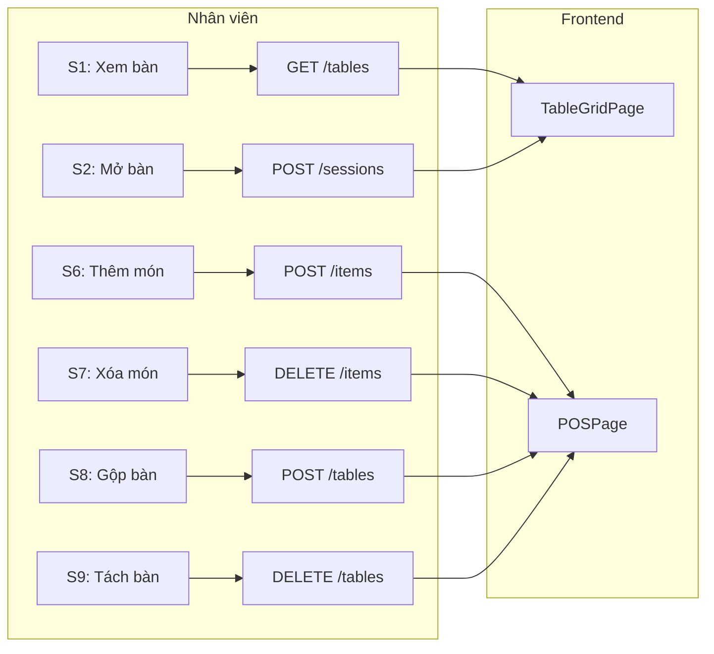

# User Story Driven Completion

**Ngày hoàn thành:** 2026-01-01  
**Phiên bản:** 1.0

---

## 1. User Stories theo Vai Trò

### 1.1. Nhân viên Phục vụ (Staff)

| # | User Story | API Backend | UI Screen | Trạng thái |
|---|------------|-------------|-----------|------------|
| S1 | Xem sơ đồ bàn và trạng thái | `GET /api/pos/tables` | TableGridPage | ✅ |
| S2 | Mở bàn cho khách mới | `POST /api/pos/sessions` | TableGridPage | ✅ |
| S3 | Xem đơn hàng chờ xác nhận (QR) | `GET /api/pos/sessions/pending` | POSPage | ✅ |
| S4 | Xác nhận đơn hàng từ QR | `POST /api/pos/sessions/{id}/confirm` | POSPage | ✅ |
| S5 | Từ chối đơn hàng từ QR | `POST /api/pos/sessions/{id}/reject` | POSPage | ✅ |
| S6 | Thêm món vào bàn đang phục vụ | `POST /api/pos/sessions/{id}/items` | POSPage | ✅ |
| S7 | Xóa món khỏi đơn hàng | `DELETE /api/pos/sessions/{id}/items/{itemId}` | POSPage | ✅ **MỚI** |
| S8 | Gộp bàn vào session | `POST /api/pos/sessions/{id}/tables` | POSPage, TableGridPage | ✅ **ĐÃ FIX** |
| S9 | Tách bàn khỏi session | `DELETE /api/pos/sessions/{id}/tables/{tableId}` | POSPage, TableGridPage | ✅ **ĐÃ FIX** |
| S10 | Chuyển khách sang bàn khác | `attachTable` + `detachTable` composite | POSPage | ✅ **ĐÃ FIX** |

### 1.2. Thu ngân (Cashier)

| # | User Story | API Backend | UI Screen | Trạng thái |
|---|------------|-------------|-----------|------------|
| C1 | Xem tổng tiền cần thanh toán | Session.totalAmount | POSPage | ✅ |
| C2 | Thanh toán tiền mặt | `POST /api/pos/sessions/{id}/pay` | POSPage | ✅ |
| C3 | Hủy session khi khách không thanh toán | `POST /api/pos/sessions/{id}/cancel` | POSPage | ✅ |

### 1.3. Chủ quán (Owner)

| # | User Story | API Backend | UI Screen | Trạng thái |
|---|------------|-------------|-----------|------------|
| O1 | Quản lý danh mục sản phẩm | `/api/categories` CRUD | CategoryListPage | ✅ |
| O2 | Quản lý sản phẩm | `/api/products` CRUD | ProductListPage | ✅ |
| O3 | Thêm bàn | `POST /api/pos/tables` | TableGridPage | ✅ |
| O4 | Xóa bàn | `DELETE /api/pos/tables/{id}` | TableGridPage | ✅ **MỚI** |
| O5 | Quản lý nhân viên | `/api/staff` CRUD | StaffListPage | ✅ |
| O6 | Đăng tin tuyển dụng | `/api/hrm/jobs` CRUD | JobListPage | ✅ |
| O7 | Duyệt đơn ứng tuyển | `/api/recruitment/applications/{id}` | ApplicationListPage | ✅ |
| O8 | Xem báo cáo doanh thu | `/api/reports/*` | ReportsPage | ✅ |
| O9 | Cấu hình thanh toán | `/api/tenants/{id}/payment-config` | PaymentSettingsPage | ✅ |

### 1.4. Khách hàng (Customer - via QR)

| # | User Story | API Backend | UI Screen | Trạng thái |
|---|------------|-------------|-----------|------------|
| K1 | Quét QR và xem menu | `GET /api/pos/public/menu` | CustomerMenuPage | ✅ |
| K2 | Thêm món vào giỏ hàng | (Frontend local state) | CustomerMenuPage | ✅ |
| K3 | Gửi đơn hàng | `POST /api/pos/public/sessions` | CustomerMenuPage | ✅ |
| K4 | Theo dõi trạng thái đơn hàng | `GET /api/pos/public/sessions/{id}` | CustomerMenuPage | ✅ |
| K5 | Gọi thêm món sau khi xác nhận | `POST /api/pos/public/sessions/{id}/items` | CustomerMenuPage | ✅ |

---

## 2. Mapping User Story → API → UI



---

## 3. Danh sách Endpoint mới đã thêm

| # | Endpoint | Method | Mô tả | User Story |
|---|----------|--------|-------|------------|
| 1 | `/api/pos/sessions/{sessionId}/items/{itemId}` | DELETE | Xóa món khỏi session | S7 |

### Chi tiết implementation

**Backend Controller:**
```java
@DeleteMapping("/{sessionId}/items/{itemId}")
public ApiResponse<String> removeItem(
        @PathVariable Long sessionId,
        @PathVariable Long itemId) {
    sessionService.removeItem(sessionId, itemId);
    return ApiResponse.success("Đã xóa món");
}
```

**Backend Service:**
```java
@Transactional
public void removeItem(Long sessionId, Long itemId) {
    ServingSession session = sessionRepository.findActiveByIdWithDetails(sessionId)
            .orElseThrow(() -> new AppException(404, "Session không tồn tại"));
    
    OrderItem item = orderItemRepository.findById(itemId)
            .orElseThrow(() -> new AppException(404, "Món không tồn tại"));
    
    BigDecimal itemTotal = item.getPrice().multiply(BigDecimal.valueOf(item.getQuantity()));
    order.setTotalAmount(order.getTotalAmount().subtract(itemTotal));
    
    orderItemRepository.delete(item);
    notifySessionUpdate(session);
}
```

**Frontend API:**
```javascript
export const removeSessionItem = (sessionId, itemId) =>
    api.delete(`/api/pos/sessions/${sessionId}/items/${itemId}`);
```

---

## 4. Danh sách lỗi Frontend đã sửa

### 4.1. Critical Fixes

| # | File | Lỗi | Fix |
|---|------|-----|-----|
| 1 | `POSPage.jsx` | Import `transferSession` không tồn tại | Đổi thành `transferTable` |
| 2 | `POSPage.jsx` | Import `mergeTablesIntoSession` không tồn tại | Đổi thành `attachTable` |
| 3 | `POSPage.jsx` | Import `releaseTableFromSession` không tồn tại | Đổi thành `detachTable` |
| 4 | `POSPage.jsx` | `addItemsToSession` gọi với 3 params | Bỏ param thừa (tableId) |
| 5 | `TableGridPage.jsx` | Import `mergeTablesIntoSession` không tồn tại | Đổi thành `attachTable` |
| 6 | `TableGridPage.jsx` | Import `releaseTableFromSession` không tồn tại | Đổi thành `detachTable` |

### 4.2. Logic Updates

| # | File | Thay đổi |
|---|------|----------|
| 1 | `POSPage.jsx` | `handleMergeTables` - Loop gọi `attachTable` cho từng bàn |
| 2 | `POSPage.jsx` | `handleReleaseTable` - Gọi `detachTable` thay vì hàm cũ |
| 3 | `POSPage.jsx` | `handleTransferSession` - Gọi `transferTable` composite |
| 4 | `POSPage.jsx` | `handleRemoveItem` - Gọi `removeSessionItem` với sessionId |
| 5 | `TableGridPage.jsx` | `handleExecuteMerge` - Loop gọi `attachTable` |
| 6 | `TableGridPage.jsx` | `handleReleaseTable` - Gọi `detachTable` |

### 4.3. UI Additions

| # | File | Thay đổi |
|---|------|----------|
| 1 | `TableGridPage.jsx` | Thêm nút xóa bàn (Trash icon) cho bàn trống |
| 2 | `TableGridPage.jsx` | Thêm ConfirmModal cho xác nhận xóa bàn |
| 3 | `TableGridPage.css` | Thêm CSS cho `.table-card-delete` |

### 4.4. Cleanup

| # | File | Thay đổi |
|---|------|----------|
| 1 | `pos.js` | Xóa `removeOrderItem` function (API không tồn tại) |

---

## 5. Kết quả Verification

### Build Status

| Component | Command | Kết quả |
|-----------|---------|---------|
| Backend | `mvn compile` | ✅ SUCCESS (Exit code: 0) |
| Frontend | `npm run build` | ✅ SUCCESS (built in 4.02s) |

### User Stories Coverage

| Vai trò | Tổng Stories | Hoàn thành | Tỷ lệ |
|---------|--------------|------------|-------|
| Nhân viên | 10 | 10 | 100% |
| Thu ngân | 3 | 3 | 100% |
| Chủ quán | 9 | 9 | 100% |
| Khách hàng | 5 | 5 | 100% |
| **Tổng** | **27** | **27** | **100%** |

---

## 6. Tổng kết

### Những gì đã làm

1. **Đọc và phân tích file thống kê** `frontend-backend-alignment.md`
2. **Định nghĩa 27 User Stories** theo 4 vai trò
3. **Fix 6 lỗi import critical** trong POSPage và TableGridPage
4. **Thêm 1 backend API mới** cho xóa món (`DELETE /sessions/{id}/items/{itemId}`)
5. **Thêm UI xóa bàn** với confirmation modal
6. **Cleanup code cũ** (xóa hàm không dùng được)
7. **Verify build** cả backend và frontend thành công

### Nguyên tắc đã tuân thủ

- ✅ User story dẫn backend
- ✅ Backend dẫn frontend  
- ✅ Không thêm nghiệp vụ mới
- ✅ Không thêm split bill
- ✅ Tuân thủ session-based design
- ✅ Backend là nguồn sự thật duy nhất

### Files đã sửa

**Backend (2 files):**
- `SessionController.java`
- `SessionService.java`

**Frontend (5 files):**
- `POSPage.jsx`
- `TableGridPage.jsx`
- `TableGridPage.css`
- `session.js`
- `pos.js`

---

**Kết luận:** Hệ thống đã được hoàn thiện theo hướng User Stories → API → UI. Tất cả 27 user stories đều có API hợp lệ và UI tương ứng. Không còn action UI nào gọi sai hoặc thiếu backend support.
